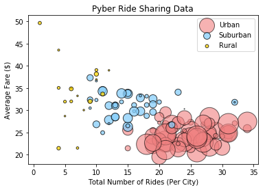
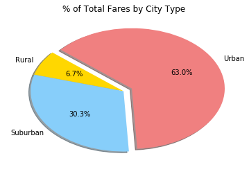
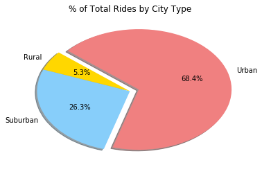

```python
#import dependencies
import matplotlib.pyplot as plt
import pandas as pd
import numpy as np
```


```python
#Read in city_data and ride_data csv
city_data = pd.read_csv("raw_data/city_data.csv")
ride_data = pd.read_csv("raw_data/ride_data.csv")
```


```python
#Create a bubble plot of the Total Number of Rides Vs. Average Fare by City Types

#Group the ride data by city
grouped_rides = ride_data.groupby("city")

#Get the total riders from the 'grouped by city' data
rides_per_city = grouped_rides["ride_id"].count()

#Get the average fare from the 'grouped by city' data
average_fare = grouped_rides["fare"].mean()

#Store the 2 metrics in a dataframe and reset the index to prep for merge
df = pd.DataFrame({"Number of Riders": rides_per_city,
                  "Average Fare": average_fare}).reset_index()

#merge the created dataframe with the city data to get the different city types
merge = pd.merge(df, city_data, on="city")

#Create variables to grab and store the individual city types
urban = merge.loc[merge["type"] == "Urban"]
suburban = merge.loc[merge["type"] == "Suburban"]
rural = merge.loc[merge["type"] == "Rural"]

#For each city type, graph a scatter plot
urban = plt.scatter(urban["Number of Riders"].values, urban["Average Fare"].values, s=urban["driver_count"].values**1.6, marker="o", facecolors="lightcoral", edgecolors="black", alpha=0.60, label="Urban")
suburban = plt.scatter(suburban["Number of Riders"].values, suburban["Average Fare"].values, s=suburban["driver_count"].values**1.6, marker="o", facecolors="LightSkyBlue", edgecolors="black", alpha=0.75, label="Suburban")
rural = plt.scatter(rural["Number of Riders"].values, rural["Average Fare"].values, s=rural["driver_count"].values**1.6, marker="o", facecolors="Gold", edgecolors="black", alpha=0.75, label="Rural")

#Add in appropriate legends, title, x-axis title and y-axis title
plt.legend(handles=[urban, suburban, rural], loc="best")
plt.title("Pyber Ride Sharing Data")
plt.xlabel("Total Number of Rides (Per City)")
plt.ylabel("Average Fare ($)")
```


    Text(0,0.5,'Average Fare ($)')





```python
#Create a pie chart - % of total fares by city type

#Get the sum of the fares of the 'grouped by city' data
total_fares = grouped_rides["fare"].sum()

#Store the total fares by city into a dataframe and reset index to prep for a merge with city data
total_fares_city_df = pd.DataFrame({"Total Fares": total_fares}).reset_index()

#Merge the total_fares_df and the city_data to bring in the city types
total_fares_merge = pd.merge(total_fares_city_df, city_data, on="city")

#Merge will generate duplicates in City column. Drop them.
total_fares_merge = total_fares_merge.drop_duplicates(subset=["city"])

#Group the new dataframe by type
grouped_type_fares = total_fares_merge.groupby("type")

#Get the sum of the total fares of the 'grouped by city type' data
fares_by_city_type = grouped_type_fares["Total Fares"].sum()

#Store the total fares by city type into a new dataframe
total_fares_city_type = pd.DataFrame({"Total Fares": fares_by_city_type}).reset_index()

#Define the attritbutes for the pie parameters
explode = (0,0,0.1)
colors = ["gold", "lightskyblue", "lightcoral"]

#Plot the pie chart with the above attributes
plt.pie(total_fares_city_type["Total Fares"].values, explode=explode, labels=total_fares_city_type["type"].values, colors=colors,
        autopct="%1.1f%%", shadow=True, startangle=140)

#Give the pie chart a title
plt.title("% of Total Fares by City Type")


```


    Text(0.5,1,'% of Total Fares by City Type')





```python
#Create a pie chart - % of total rides by city type

#Get the count of ids of the 'grouped by city' data
total_rides = grouped_rides["ride_id"].count()

#Store the total rides by city into a dataframe and reset index to prep for a merge with city data
total_rides_city_df = pd.DataFrame({"Total Rides": total_rides}).reset_index()

#Merge the total_rides_df and the city_data to bring in the city types
total_rides_merge = pd.merge(total_rides_city_df, city_data, on="city")

#Merge will generate duplicates in City column. Drop them.
total_rides_merge = total_rides_merge.drop_duplicates(subset=["city"])

#Group the new dataframe by type
grouped_type = total_rides_merge.groupby("type")

#Get the sum of the total rides of the 'grouped by city type' data
rides_by_city_type = grouped_type["Total Rides"].sum()

#Store the total rides by city type into a new dataframe
total_rides_city_type = pd.DataFrame({"Total Rides": rides_by_city_type}).reset_index()

#Define the attritbutes for the pie parameters
explode = (0,0,0.1)
colors = ["gold", "lightskyblue", "lightcoral"]

#Plot the pie chart with the above attributes
plt.pie(total_rides_city_type["Total Rides"].values, explode=explode, labels=total_rides_city_type["type"].values, colors=colors,
        autopct="%1.1f%%", shadow=True, startangle=140)

#Give the pie chart a title
plt.title("% of Total Rides by City Type")


```


    Text(0.5,1,'% of Total Rides by City Type')





```python
#Create a pie chart - % of total drivers by city type

#Get the sum of the total drivers of the 'grouped by city type' data
drivers_by_city_type = grouped_type["driver_count"].sum()

#Store the total drivers by city type into a new dataframe
total_drivers_city_type = pd.DataFrame({"Total drivers": drivers_by_city_type}).reset_index()
total_drivers_city_type

#Define the attritbutes for the pie parameters
explode = (0,0,0.1)
colors = ["gold", "lightskyblue", "lightcoral"]

#Plot the pie chart with the above attributes
plt.pie(total_drivers_city_type["Total drivers"].values, explode=explode, labels=total_drivers_city_type["type"].values, colors=colors,
        autopct="%1.1f%%", shadow=True, startangle=140)

#Give the pie chart a title
plt.title("% of Total Drivers by City Type")
```


    Text(0.5,1,'% of Total Drivers by City Type')


3 Observable Trends:

1. People living in urban cities are more likely to take Pyber and their average fare is lower than suburban and rural areas.
2. There are more drivers in the urban cities most likely due to demand for pyber services in urban areas.
3. Rides in rural areas have a much higher fare due to the fact that there is less demand for those services. 
